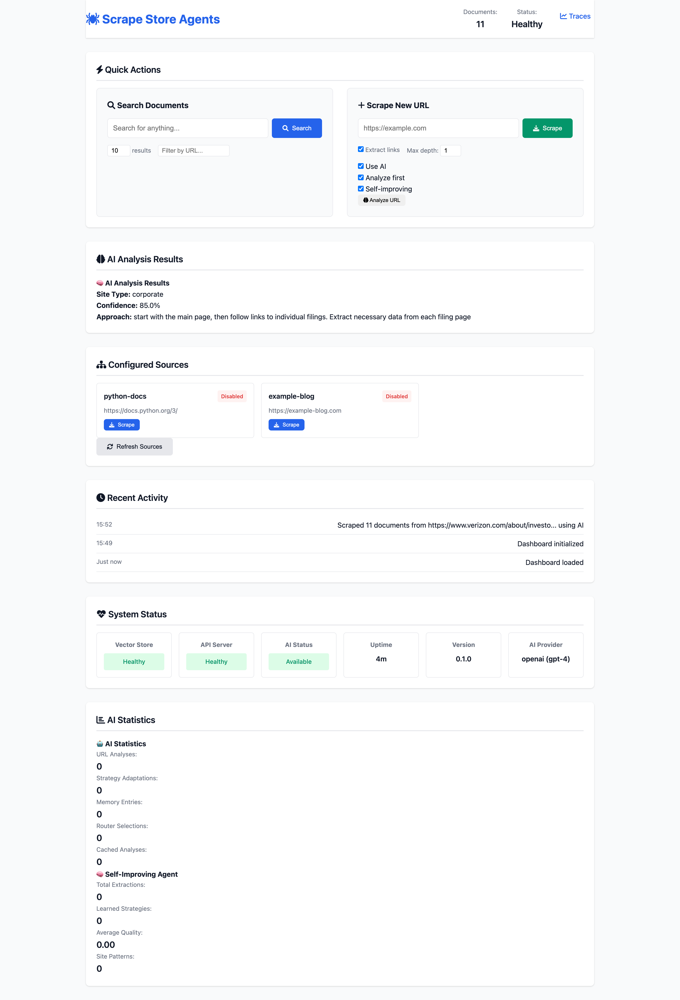

# 🕷️ Scrape Store Agents

An **AI-powered** web scraping and vector storage framework with intelligent reasoning capabilities. Get from any website to a searchable knowledge base with **true AI agents** that learn, adapt, and optimize automatically.

**✨ Now with Web Dashboard!** Complete with visual interface for scraping, searching, and monitoring.

**Perfect for:** Documentation sites, news aggregation, research papers, e-commerce data, blog content, and competitive intelligence.

## ⚡ Quick Start (5 Minutes)

```bash
# 1. Clone and start with Docker
git clone https://github.com/angakh/scrape-store-agents.git
cd scrape-store-agents
docker-compose up -d

# 2. Open the Web Dashboard
open http://localhost:8000

# 3. Use the Web Interface:
# - Enter "https://docs.python.org/3/" in the scrape box
# - Enable "Use AI" for intelligent scraping (requires API key setup)
# - Click "Scrape" and wait for completion
# - Search for "list comprehension" in the search box
```

That's it! You now have a **web dashboard** with a searchable vector database of Python documentation.

## 🎯 Use Cases

- **📚 Documentation Search**: Scrape dev docs, create AI-powered search
- **📰 News Intelligence**: Build custom news search engines  
- **🛒 E-commerce**: Extract and search product information
- **📝 Knowledge Bases**: Aggregate blogs and articles
- **🔬 Research**: Index academic papers and publications
- **🕵️ Competitive Intel**: Monitor competitor websites

## 🏗️ Architecture

```
┌─────────────────┐    ┌──────────────────┐    ┌─────────────────┐
│ 🤖 AI Agent    │───▶│  Vector Store    │───▶│   Search API    │
│ (ReasoningAgent)│    │   (ChromaDB)     │    │   (FastAPI)     │
│                 │    │                  │    │                 │
│ • URL Analysis  │    │ • Smart Storage  │    │ • AI Search     │
│ • Strategy      │    │ • Auto Chunking  │    │ • Web Dashboard │
│   Adaptation    │    │ • Embeddings     │    │ • REST API      │
│ • Memory System │    │                  │    │                 │
└─────────────────┘    └──────────────────┘    └─────────────────┘
         │                       │                       │
         ▼                       ▼                       ▼
   Any Website              AI-Optimized              Intelligent
                           Embeddings                   Search
```

## 🚀 Features

### 🧠 AI-Powered Intelligence
- **🤖 ReasoningAgent**: True AI agent with LLM-powered decision making
- **📊 URL Analysis**: AI analyzes websites and determines optimal scraping strategies
- **🔄 Strategy Adaptation**: Learns from failures and automatically adjusts approaches
- **💾 Smart Storage**: AI decides optimal chunking and embedding strategies
- **📚 Memory System**: Agents remember experiences and improve over time
- **🧠 Self-Improving Agent**: Learns from extraction quality and optimizes strategies automatically
- **📈 Quality Assessment**: AI validates extraction quality and learns from results
- **🎯 Multi-LLM Support**: Works with OpenAI GPT models and Anthropic Claude

### ✅ Ready Out of the Box
- **🌐 Web Dashboard**: Modern web interface for easy management
- **Generic Web Scraper**: Works with any website
- **ChromaDB Integration**: Production-ready vector storage
- **FastAPI Server**: RESTful search endpoints
- **Docker Setup**: One-command deployment
- **CLI Interface**: Command-line management

### 🔧 Highly Extensible
- **Plugin Architecture**: Add custom scrapers for any content type
- **Configuration-Driven**: No hardcoded sources
- **Abstract Base Classes**: Clean extension points
- **Custom Metadata**: Flexible document enrichment

### 🛡️ Production Ready
- **Error Handling**: Robust error recovery
- **Logging**: Comprehensive logging system
- **Health Checks**: Built-in monitoring
- **Type Safety**: Full typing with Pydantic
- **Testing**: Core functionality tests

## 📦 Installation

### Option 1: Docker (Recommended)
```bash
git clone https://github.com/angakh/scrape-store-agents.git
cd scrape-store-agents
docker-compose up -d
```

### Option 2: Local Installation
```bash
git clone https://github.com/angakh/scrape-store-agents.git
cd scrape-store-agents

# Install dependencies
pip install -e .

# Copy and configure settings (including AI API keys)
cp config/config.example.yml config/config.yml
# Edit config.yml with your OpenAI/Anthropic API keys and settings

# Start the API server
scrape-store serve
```

## ⚙️ Configuration

### 🔧 Initial Setup

**1. Copy the configuration template:**
```bash
cp config/config.example.yml config/config.yml
```

**2. Add your AI API keys:**
```yaml
# config/config.yml
api:
  openai_api_key: "your-openai-key-here"      # Get from https://platform.openai.com/api-keys
  anthropic_api_key: "your-anthropic-key-here" # Get from https://console.anthropic.com/

ai:
  provider: "openai"        # or "anthropic"
  model: "gpt-4"           # or "claude-3-sonnet"
  temperature: 0.1
```

**3. Customize other settings as needed:**
```yaml
# Scraper settings
scraper:
  timeout: 30
  max_depth: 2
  extract_links: true

# Vector store settings  
vector_store:
  type: chromadb
  collection_name: my_docs
  persist_directory: ./data/chroma

# AI features
ai:
  reasoning_agent: true      # Enable AI-powered decision making
  intelligent_router: true  # Enable smart scraper selection
  cache_analyses: true      # Cache AI analyses to reduce API costs

# Scraping sources
sources:
  - name: python-docs
    url: https://docs.python.org/3/
    enabled: true
    schedule: "0 2 * * 0"  # Weekly
    custom_config:
      max_depth: 3
      
  - name: fastapi-docs
    url: https://fastapi.tiangolo.com/
    enabled: true
    custom_config:
      content_selectors: [".md-content"]
```

### 🔐 Security Notes

- `config.yml` is gitignored to protect your API keys
- You can also use environment variables: `OPENAI_API_KEY`, `ANTHROPIC_API_KEY`  
- Never commit API keys to version control

### 🎛️ Environment Variables

Alternative to `config.yml`, you can use environment variables:

```bash
export OPENAI_API_KEY="your-key-here"
export AI_PROVIDER="openai"
export AI_MODEL="gpt-4"
export AI_TEMPERATURE="0.1"
```

## 🌐 Web Dashboard

The framework includes a modern web interface for easy management:



### **🎯 Dashboard Features**
- **🧠 AI-Powered Scraping** - Intelligent URL analysis and scraper selection
- **🤖 Smart Analysis** - Pre-scraping site analysis with confidence scores
- **📊 Real-time Statistics** - Document count, system health, AI metrics
- **🔍 Instant Search** - Full-text search with scoring and filters  
- **➕ Intelligent URL Scraping** - AI-enhanced scraping with strategy recommendations
- **📚 Source Management** - View and control configured sources
- **🕐 Activity Monitoring** - Real-time scraping and search logs with AI insights
- **📈 System Status** - Health checks, performance metrics, and AI availability

### **🚀 Access Points**
```bash
# Main Dashboard
http://localhost:8000/

# API Documentation  
http://localhost:8000/docs

# Health Check
http://localhost:8000/health
```

### **💡 Web Interface Benefits**
- **No CLI required** - Everything through the browser
- **Visual feedback** - See results and progress immediately
- **Team friendly** - Share with non-technical users
- **Mobile responsive** - Works on any device
- **Real-time updates** - Live system monitoring

## 🎯 Usage Patterns

### 🧠 AI-Powered Workflows
- **Smart Analysis**: AI analyzes URLs to determine optimal scraping strategies
- **Intelligent Routing**: Automatically selects the best scraper for each site type
- **Adaptive Learning**: AI learns from failures and improves over time
- **Perfect for**: Complex sites, anti-bot evasion, content quality optimization

### 🧪 Development & Testing
- **Web Dashboard**: Quick URL testing, demonstrations, ad-hoc searches with AI insights
- **Perfect for**: Prototyping, showing stakeholders, AI-powered content analysis

### 🚀 Production & Automation  
- **YAML Config + API**: Scheduled scraping with AI decision-making
- **Perfect for**: CI/CD pipelines, automated systems, intelligent content extraction

## 🖥️ Usage

### CLI Commands

#### 🤖 AI-Powered Commands

```bash
# Initialize configuration with AI setup
scrape-store init

# Analyze a URL with AI (without scraping)
scrape-store analyze https://example.com --detailed

# Scrape with AI features enabled
scrape-store scrape https://docs.python.org/3/ --ai --ai-analyze

# Use self-improving agent that learns from extractions
scrape-store scrape https://docs.python.org/3/ --ai --self-improving

# Check AI status and configuration
scrape-store status
```

#### 📚 Standard Commands

```bash
# Scrape a single URL (auto-detects AI)
scrape-store scrape https://docs.python.org/3/ --max-depth 2

# Force standard scraping (no AI)
scrape-store scrape https://example.com --no-ai

# Search content
scrape-store search "async functions" --limit 5

# Run configured sources
scrape-store run --source python-docs
scrape-store run --all

# Start API server
scrape-store serve --host 0.0.0.0 --port 8000
```

### API Endpoints

#### 🤖 AI-Enhanced Endpoints

```bash
# AI-powered scraping with self-improving capabilities
POST /scrape
{
  "url": "https://example.com",
  "use_ai": true,
  "analyze_first": true,
  "self_improving": true,
  "scraper_config": {
    "max_depth": 2,
    "extract_links": true
  }
}

# AI URL analysis (without scraping)
POST /analyze
{
  "url": "https://example.com",
  "detailed": true
}

# AI configuration status
GET /ai/config

# AI performance statistics
GET /ai/stats

# Clear AI cache and memory
POST /ai/clear-cache
```

#### 📚 Standard Endpoints

```bash
# Search documents  
POST /search
{
  "query": "machine learning",
  "limit": 10,
  "filters": {"url": "docs.python.org"}
}

# Get search (simple)
GET /search?q=python&limit=5

# Check health (includes AI status)
GET /health

# Get statistics
GET /stats
```

### Python API

#### Basic Usage
```python
from scrape_store_agents import Agent
from scrape_store_agents.agents.scrapers import WebScraper
from scrape_store_agents.agents.vector_stores import ChromaDBStore

# Initialize components
scraper = WebScraper({
    "timeout": 30,
    "max_depth": 2,
    "extract_links": True
})

vector_store = ChromaDBStore({
    "collection_name": "my_docs",
    "persist_directory": "./data"
})

# Create agent
agent = Agent(scraper, vector_store)

# Scrape and store
docs_count = await agent.scrape_and_store("https://docs.python.org/3/")

# Search
results = await agent.search("list comprehensions", limit=5)
for result in results:
    print(f"Score: {result.score}")
    print(f"Title: {result.document.title}")
    print(f"URL: {result.document.url}")
```

#### AI-Powered Reasoning Agent
```python
from scrape_store_agents import ReasoningAgent
from scrape_store_agents.agents.scrapers import WebScraper
from scrape_store_agents.agents.vector_stores import ChromaDBStore

# Initialize components
scraper = WebScraper({"timeout": 30})
vector_store = ChromaDBStore({"collection_name": "my_docs"})

# Configure AI reasoning
llm_config = {
    "provider": "openai",  # or "anthropic" 
    "model": "gpt-4",      # or "claude-3-sonnet"
    "api_key": "your-api-key",
    "temperature": 0.1
}

# Create AI-powered agent
ai_agent = ReasoningAgent(scraper, vector_store, llm_config)

# AI analyzes the URL and determines optimal strategy
analysis = await ai_agent.analyze_url("https://complex-website.com")
print(f"Site type: {analysis['site_type']}")
print(f"Recommended approach: {analysis['scraping_approach']}")

# AI adapts when scraping fails
if failed_attempts:
    adaptation = await ai_agent.adapt_scraping_strategy(url, failed_attempts)
    print(f"New strategy: {adaptation['alternative_approach']}")

# AI decides optimal storage strategy
storage_strategy = await ai_agent.decide_storage_strategy(documents)
print(f"Optimal chunk size: {storage_strategy['chunk_size']}")

# View AI reasoning statistics
stats = await ai_agent.get_reasoning_stats()
print(f"AI made {stats['url_analyses']} URL analyses")
print(f"AI adapted strategies {stats['strategy_adaptations']} times")
```

#### Intelligent Scraper Router
```python
from scrape_store_agents.agents.router import IntelligentScraperRouter

# Initialize AI router
llm_config = {
    "provider": "openai",
    "model": "gpt-4",
    "api_key": "your-api-key"
}

router = IntelligentScraperRouter(llm_config)

# AI analyzes site and selects optimal scraper
analysis = await router.analyze_site("https://news-site.com")
recommendation = await router.select_scraper("https://news-site.com")

print(f"Site type: {analysis.site_type}")
print(f"Recommended scraper: {recommendation.scraper_type}")
print(f"Confidence: {recommendation.confidence}")
print(f"Rationale: {recommendation.rationale}")

# Complete AI-powered scraping pipeline
scraper, documents = await router.route_and_scrape("https://example.com")
print(f"Used {scraper.__class__.__name__} to extract {len(documents)} documents")
```

#### Self-Improving Agent
```python
from scrape_store_agents.agents.self_improving import SelfImprovingAgent

# Initialize self-improving agent
llm_config = {
    "provider": "openai",
    "model": "gpt-4",
    "api_key": "your-api-key",
    "temperature": 0.1
}

# Create agent that learns from extraction quality
self_improving_agent = SelfImprovingAgent(scraper, vector_store, llm_config)

# Scrape with learning - agent will assess quality and learn
documents_count = await self_improving_agent.scrape_and_store_with_learning("https://example.com")

# Check learning statistics
stats = await self_improving_agent.get_learning_stats()
print(f"Total extractions: {stats['total_extractions']}")
print(f"Learned strategies: {stats['learned_strategies']}")
print(f"Average quality: {stats['average_quality']:.2f}")
print(f"Site patterns learned: {stats['site_patterns_learned']}")

# Get optimized strategy for a URL based on learning
optimized_strategy, confidence = await self_improving_agent.get_optimized_strategy("https://similar-site.com")
print(f"Optimized strategy confidence: {confidence:.2f}")

# Clear learning data if needed
cleared_stats = self_improving_agent.clear_learning_data()
print(f"Cleared {cleared_stats['extraction_history']} extraction records")
```

## 🧠 AI Workflows

### 🎯 Smart URL Analysis
Perfect for understanding websites before scraping:

```bash
# Analyze any URL with AI
scrape-store analyze https://complex-site.com --detailed

# Web Dashboard: Use "Analyze URL" button
# API: POST /analyze with URL
```

**AI provides:**
- Site type detection (news, blog, e-commerce, docs)
- Complexity assessment (simple, moderate, complex, dynamic)
- Anti-bot measures identification
- Optimal scraping strategy recommendations
- Confidence scores for all decisions

### 🤖 Intelligent Scraping
AI automatically selects the best approach:

```bash
# CLI with AI analysis before scraping
scrape-store scrape https://example.com --ai --ai-analyze

# Web Dashboard: Check "Use AI" and "Analyze First"
# API: POST /scrape with use_ai: true, analyze_first: true
```

**AI capabilities:**
- **Smart Scraper Selection**: Chooses optimal scraper based on site analysis
- **Dynamic Configuration**: Adjusts timeouts, delays, and selectors automatically
- **Adaptive Learning**: Learns from failures and improves strategies
- **Graceful Fallback**: Falls back to standard scraping if AI fails

### 📊 AI Performance Monitoring
Track AI decision-making and improvements:

```bash
# CLI status includes AI metrics
scrape-store status

# API endpoints for AI monitoring
GET /ai/config    # Configuration status
GET /ai/stats     # Performance metrics
POST /ai/clear-cache  # Reset AI memory
```

**Metrics tracked:**
- URL analyses performed
- Strategy adaptations made
- Scraper selection accuracy
- Cache hit rates
- Memory usage

### 🔄 Continuous Learning
AI agents improve over time:

- **Memory System**: Remembers successful strategies for similar sites
- **Failure Analysis**: Learns from scraping failures and adapts
- **Pattern Recognition**: Identifies common site structures and anti-bot measures
- **Strategy Optimization**: Refines approaches based on success rates

## 🔌 Extending the Framework

### Custom Scraper

```python
from scrape_store_agents.agents.base import BaseScraper, Document

class CustomScraper(BaseScraper):
    async def scrape(self, url: str, **kwargs) -> List[Document]:
        # Your custom scraping logic
        return documents
    
    def validate_url(self, url: str) -> bool:
        # URL validation logic
        return True
```

### Custom Vector Store

```python
from scrape_store_agents.agents.base import BaseVectorStore, SearchResult

class CustomVectorStore(BaseVectorStore):
    async def add_documents(self, documents: List[Document]) -> None:
        # Storage implementation
        pass
    
    async def search(self, query: str, limit: int = 10) -> List[SearchResult]:
        # Search implementation
        return results
```

## 🐳 Docker Deployment

### Basic Deployment
```bash
docker-compose up -d
```

### Production Deployment
```bash
# With nginx proxy and SSL
docker-compose --profile production up -d

# With automatic scheduling
docker-compose --profile scheduler up -d

# With ChromaDB UI
docker-compose --profile ui up -d
```

### Environment Variables
```env
# API Configuration
API_HOST=0.0.0.0
API_PORT=8000
API_DEBUG=false

# Vector Store
VECTOR_STORE_TYPE=chromadb
VECTOR_STORE_HOST=chromadb
VECTOR_STORE_PORT=8000
VECTOR_STORE_PERSIST_DIR=/data/chroma

# Logging
LOG_LEVEL=INFO
LOG_FILE=/logs/app.log
```

## 📊 Monitoring

### Health Checks
```bash
curl http://localhost:8000/health
```

### Statistics
```bash
curl http://localhost:8000/stats
```

### Logs
```bash
docker-compose logs -f scrape-store-agents
```

## 🧪 Testing

```bash
# Install development dependencies
pip install -e ".[dev]"

# Run tests
pytest

# Run with coverage
pytest --cov=scrape_store_agents

# Type checking
mypy scrape_store_agents

# Code formatting
black scrape_store_agents
```

## 🤝 Contributing

1. Fork the repository
2. Create a feature branch: `git checkout -b feature/amazing-feature`
3. Commit changes: `git commit -m 'Add amazing feature'`
4. Push to branch: `git push origin feature/amazing-feature`
5. Open a Pull Request

## 📄 License

This project is licensed under the MIT License - see the [LICENSE](LICENSE) file for details.

## 🆘 Support

- 📖 [Documentation - Coming Soon](https://github.com/angakh/scrape-store-agents/wiki)
- 🐛 [Bug Reports](https://github.com/angakh/scrape-store-agents/issues)

## 🗺️ Roadmap

- [x] **Web dashboard for management** ✅ **COMPLETED!**
- [x] **AI-powered reasoning agents** ✅ **COMPLETED!**
- [x] **Intelligent scraper router** ✅ **COMPLETED!**
- [x] **Self-improving capabilities** ✅ **COMPLETED!**
- [ ] **Dynamic selector generation** (AI creates custom CSS selectors)
- [ ] Additional vector stores (Pinecone, Weaviate, Qdrant)
- [ ] More scraper types (RSS, API, PDF, etc.)
- [ ] User authentication for web dashboard
- [ ] Kubernetes deployment configs
- [ ] Advanced scheduling with cron
- [ ] Content deduplication
- [ ] Multi-language support
- [ ] Real-time scraping with webhooks
- [ ] Export functionality (search results, configurations)
- [ ] Dark mode for web interface

---

**⭐ Star this repo if you find it useful!**

Built with ❤️ for the open source community.